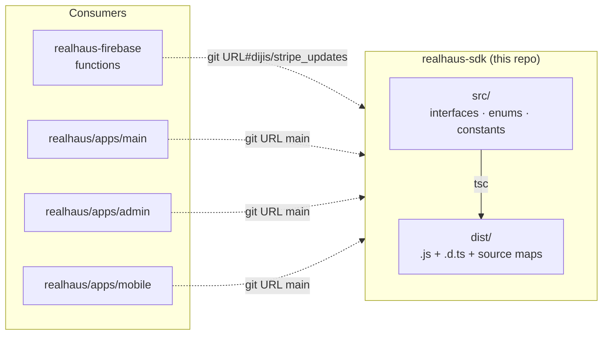
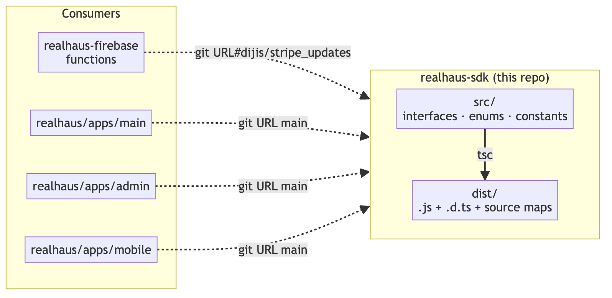
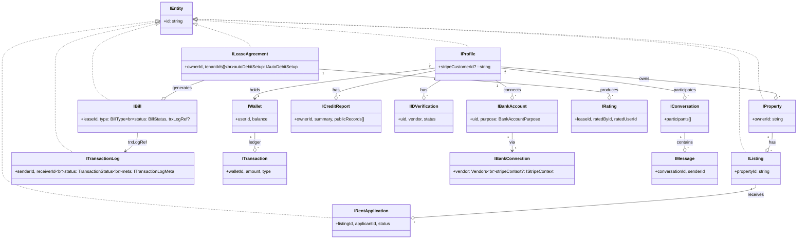
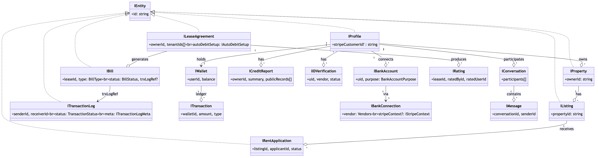

# Realhaus SDK — Architecture

> This document covers the **realhaus-sdk** repository: the zero-dependency TypeScript types library that defines the domain contract shared across the Realhaus platform. It is one of three repositories that compose the system. See [Where to next](#where-to-next) for the sibling docs.

The document is split into two parts:

- **Part A — Orientation** (5 minutes): what the SDK is for, who consumes it, how to extend it.
- **Part B — Reference**: per-subsystem deep dive intended as a working source of truth.

---

## Part A — Orientation

### What this repo is

`realhaus-sdk` is a **pure TypeScript types library** with **zero runtime dependencies**. It contains only:

- **interfaces** — domain object shapes (`IProfile`, `ILeaseAgreement`, `IRentApplication`, `ITransactionLog`, etc.)
- **enums** — string/number enumerations (`LeaseAgreementStatus`, `TransactionStatus`, `Vendors`, `BankAccountPurpose`, etc.)
- **constants** — lookup tables (Canadian provinces, amenity lists, credit-score ranges, calendar helpers, lease policy values).

It does **not** contain HTTP clients, validation schemas (no Zod / Yup / io-ts), runtime helpers, classes, or Firebase wrappers. Consumers handle transport themselves.

The SDK exists so the [realhaus-firebase](../realhaus-firebase/) backend and every client app in [realhaus](../realhaus/) (main web, admin web, mobile) compile against the **same shape** for every domain object. When a field is added to a lease or a bill, it is added here once.

Current version: **2.0.0**. Published from GitHub as a git URL (`git+https://github.com/dijistanley/realhaus-sdk.git`); consumers pin a branch.

### System context



<details>
<summary>PNG fallback (if Mermaid doesn't render)</summary>



</details>

The **backend pins the `dijis/stripe_updates` branch** while Stripe/PAD work is in flight; **all client apps pin the default (`main`) branch**. This is the operative branch contract today — keep it in mind when adding types that need to land in one half of the system before the other.

### Start here

1. [src/index.ts](src/index.ts) — the single barrel export. Every public type re-exports from one of these three folders.
2. [src/interfaces/](src/interfaces/) — domain shape files. One file per top-level domain (lease, property, rentApplication, wallet, bankAccount, creditReport, identityVerification, message, rating, …).
3. [src/enums/](src/enums/) — discrete value sets used across interfaces (lease, wallet, bankAccount, rentApplication, appointment, coupon, creditScore, identityVerification, inputField, userManagement).
4. [src/constants/](src/constants/) — lookup tables (amenities, calendar, creditScore, lease, provinces).
5. [CLAUDE.md](CLAUDE.md) — conventions, naming rules, and current-work notes.

### Adding a new type

```bash
# 1. Create the file in the right folder
src/interfaces/foo.ts          # new interface
src/enums/foo.ts               # new enum
src/constants/foo.ts           # new constant lookup

# 2. Re-export from src/index.ts (the barrel is the public API)
export * from './interfaces/foo';

# 3. Build to verify the type compiles
npm run build                  # tsc — fails on any TS error
```

That's the entire developer loop. There is **no test framework, no linter**, and `.vscode/settings.json` enforces single quotes + format-on-save.

### Publishing / versioning

The SDK is **not** published to npm. Consumers install it via git URL and pin a branch (or commit SHA) in their `package.json`. To roll a change:

1. Land the type change on the appropriate branch (`main` for client-only changes; `dijis/stripe_updates` for changes the backend needs).
2. Bump `version` in [package.json](package.json) if the change is breaking or worth signalling to consumers.
3. Push. Consumers pick up the change on their next `yarn install` (or when they update the commit SHA in their lockfile).

---

## Part B — Reference

### Build pipeline

| Step | Command | Output |
|---|---|---|
| Compile | `npm run build` (= `tsc`) | `dist/index.js`, `dist/index.d.ts`, source maps, full mirror of `src/` subdirs |
| Pre-publish | `npm run prepare` | Re-runs `build` automatically |

TypeScript configuration ([tsconfig.json](tsconfig.json)): `target: es2016`, `module: commonjs`, `strict: true`, output to `dist/`. Both `src/` and `dist/` are shipped in the published package (`files: ["dist", "src"]` in [package.json](package.json)).

There is **no test framework or linter configured**; type safety is the only enforcement. Always run `npm run build` before pushing.

### Public API surface

Every consumer imports from the root: `import { X } from 'realhaus-sdk'`. There are no subpath exports.

Categories (from [src/index.ts](src/index.ts)):

#### Constants

| File | Purpose |
|---|---|
| [constants/amenities.ts](src/constants/amenities.ts) | Amenity lookup list |
| [constants/calendar.ts](src/constants/calendar.ts) | Calendar/day helpers |
| [constants/creditScore.ts](src/constants/creditScore.ts) | Credit-score range buckets |
| [constants/lease.ts](src/constants/lease.ts) | Lease policy lookup values |
| [constants/provinces.ts](src/constants/provinces.ts) | **Canadian** provinces (the platform is Canada-only) |

#### Enums

| File | Notable members |
|---|---|
| [enums/appointment.ts](src/enums/appointment.ts) | appointment status / type |
| [enums/bankAccount.ts](src/enums/bankAccount.ts) | `Vendors` (`PAYPAL`, `STRIPE`), `BankAccountPurpose` (`PAYMENTS`, `PAYOUTS`), `AccountConnectionState` |
| [enums/coupon.ts](src/enums/coupon.ts) | coupon types/states |
| [enums/creditScore.ts](src/enums/creditScore.ts) | credit grade enums |
| [enums/identityVerification.ts](src/enums/identityVerification.ts) | ID verification status |
| [enums/inputField.ts](src/enums/inputField.ts) | input field enums (for forms) |
| [enums/lease.ts](src/enums/lease.ts) | `LeaseAgreementStatus`, `AutoDebitSetupStatus`, `RentDueDay`, `FeePaymentFrequency`, `RentInsuranceStatus`, `LeaseEndAction`, `OccupantRelationship` |
| [enums/rentApplication.ts](src/enums/rentApplication.ts) | rent application status/types |
| [enums/userManagement.ts](src/enums/userManagement.ts) | user management actions/roles |
| [enums/wallet.ts](src/enums/wallet.ts) | `TransactionType`, `TransactionStatus` (including `PENDING_VENDOR`), `TrxLogType` |

Note: a few enums tightly coupled to a single domain (`IncomeType`, `IdentityType`, `ProofOfOccupationType`) live **inside** their interface file (e.g. `interfaces/user.ts`) rather than under `enums/`.

#### Interfaces

| File | Key exports |
|---|---|
| [interfaces/address.ts](src/interfaces/address.ts) | `IAddress` |
| [interfaces/amenities.ts](src/interfaces/amenities.ts) | amenity shape helpers |
| [interfaces/appointment.ts](src/interfaces/appointment.ts) | `Appointment`, `IDAppointment` |
| [interfaces/bankAccount.ts](src/interfaces/bankAccount.ts) | `IBankAccount`, `IBankConnection`, `IStripeContext` (`connectedAccountId`), `IPaypalContext`, `IConfirmAutoDebitAgreementRequest`, `IAccountConnectionStatusResponse` |
| [interfaces/bill.ts](src/interfaces/bill.ts) | `IBill`, `BillStatus`, `BillType` |
| [interfaces/coupon.ts](src/interfaces/coupon.ts) | coupon interfaces |
| [interfaces/creditReport.ts](src/interfaces/creditReport.ts) | `ICreditReport`, `ICreditReportAccountSummary`, public-record shapes |
| [interfaces/creditReportSeats.ts](src/interfaces/creditReportSeats.ts) | seat accounting types |
| [interfaces/description.ts](src/interfaces/description.ts) | description shape |
| [interfaces/entity.ts](src/interfaces/entity.ts) | `IEntity { id: string }`, `IDocument { id, createdAt, updatedAt }` base shapes |
| [interfaces/googlemaps.ts](src/interfaces/googlemaps.ts) | Google Maps response shapes |
| [interfaces/identityVerification.ts](src/interfaces/identityVerification.ts) | `IIDVerification` |
| [interfaces/lease.ts](src/interfaces/lease.ts) | base lease types |
| [interfaces/leaseAgreement.ts](src/interfaces/leaseAgreement.ts) | `ILeaseAgreement`, `IdLeaseAgreement`, `ILeasePolicy` (incl. `tenantInsuranceDoc?`), `ILeaseFees`, `IAutoDebitSetup`, `StripePADSetup`, `IOccupant`, `IInsuranceDoc` |
| [interfaces/mail.ts](src/interfaces/mail.ts) | outbound mail entries |
| [interfaces/message.ts](src/interfaces/message.ts) | `IConversation`, `IMessage`, `IdMessage` |
| [interfaces/property.ts](src/interfaces/property.ts) | `IProperty`, `IdProperty`, `PropertyTypeEnum`, `IListing`, `IdListing`, `IListingTerm`, `IListingPolicy` |
| [interfaces/prospectiveTenant.ts](src/interfaces/prospectiveTenant.ts) | invitee shapes |
| [interfaces/rating.ts](src/interfaces/rating.ts) | `IRating`, `IdRating`, `ILeaseRatingReviewDetails`, `RatingsForTenant`, `RatingsForLandlord` |
| [interfaces/rentApplication.ts](src/interfaces/rentApplication.ts) | `IRentApplication`, `IRentApplicationForm` (`hasPets`, `hasVehicle`, `smokes` are `boolean`) |
| [interfaces/user.ts](src/interfaces/user.ts) | `IProfile` (`stripeCustomerId`), `IUserBio`, `ITenantProfile`, `IOccupation`, `IIdentity`, `IncomeType`, `IdentityType`, `ProofOfOccupationType` |
| [interfaces/userGroups.ts](src/interfaces/userGroups.ts) | conversation/user-group shapes |
| [interfaces/wallet.ts](src/interfaces/wallet.ts) | `IWallet`, `ITransaction`, `ITransactionLog`, `IDTransactionLog`, `ITransactionLogMeta` (intentional `[x: string]: any` for vendor metadata) |

### Domain model overview

The diagram below captures the most important relationships consumers should hold in their head. Field-level details belong in the interface files themselves.



<details>
<summary>PNG fallback (if Mermaid doesn't render)</summary>



</details>

### Naming conventions

- **Interfaces** are `I`-prefixed: `IUser`, `ILeaseAgreement`, `IProperty`.
- **Entity-with-id composites** are `Id`-prefixed types built via intersection: `type IdProperty = IEntity & IProperty`, `type IdLeaseAgreement = IEntity & ILeaseAgreement`. Use these when a record was loaded *with* its Firestore document ID; use the bare interface for new records being constructed before insert.
- **Derived shapes** use `Omit` + intersection: e.g. `type ILeaseListingInfo = Omit<IListing, 'propertyId'> & Omit<IProperty, 'ownerId'>`.
- **Enums** are PascalCase with a descriptive suffix: `PropertyTypeEnum`, `LeaseAgreementStatus`, `TransactionType`.
- **Constants** are camelCase arrays or PascalCase objects: `provinces`, `Amenities`, `creditScoreRanges`.
- **Strings**: single quotes everywhere.
- **No classes**, no runtime logic — pure declarations.

### Key domain notes consumers must remember

These are pitfalls and deliberate design choices. Read them once and refer back.

- **Always use enum members, not raw strings.** `LeaseAgreementStatus.SIGNED` not `'signed'`. The backend's `realhaus-firebase` enforces this convention; mixing raw strings is the most common source of subtle bugs.
- **`Vendors` enum has exactly two members: `PAYPAL` and `STRIPE`.** Flinks was removed. Plaid is also gone from the backend (the `plaid` package remains in `package.json` but is unused).
- **Stripe identifiers are always strings.** `StripePADSetup` carries `mandateId`, `customerId`, `paymentMethodId`, `setupIntentId`. If Stripe returns an expanded object, **normalize it to `.id`** before storing.
- **`IProfile.stripeCustomerId`** is the bridge between a Realhaus user and their Stripe Customer; the PAD flow requires it.
- **`IStripeContext.connectedAccountId`** stores the Stripe Connected Account ID on `IBankConnection` (landlord side).
- **`AutoDebitSetupStatus`**: `INCOMPLETE → PENDING → COMPLETED | FAILED`. Auto-debit charging only runs against leases in `COMPLETED`.
- **`TransactionStatus.PENDING_VENDOR`** is used while a payment awaits Stripe webhook confirmation (between PaymentIntent creation and the `payment_intent.succeeded` callback).
- **`ITransactionLogMeta.[x: string]: any`** is intentional — vendor payloads vary widely; the `vendor: { req: unknown; resp: unknown }` slot stores raw request/response bodies for audit. Do not tighten this signature.
- **Tenant insurance**: `ILeasePolicy.tenantInsuranceDoc` (typed as `IInsuranceDoc`) plus `RentInsuranceStatus` tracks proof-of-insurance upload and review.
- **Boolean fields on rent applications**: `IRentApplicationForm.hasPets / hasVehicle / smokes` are `boolean`, not strings.
- **Canada only**: `constants/provinces.ts` covers Canadian provinces. There is no US-state equivalent.

### What this SDK is *not*

To prevent scope creep, this list is also useful at code-review time:

- **No HTTP client.** No `axios`, no `fetch` wrappers, no Firebase callable bindings. Consumers own transport.
- **No runtime validation.** No Zod, Yup, io-ts. Inputs are validated where they enter the system (Cloud Function handlers) using ad-hoc checks.
- **No classes**, no service objects, no constructors. Types only. The single exception is the occasional mapped type for rating grades.
- **No business logic.** If a function needs to compute a fee or transform a record, it belongs in `realhaus-firebase/services` or in a frontend store — not here.

### Versioning + branch usage

- **Current package version**: `2.0.0` (in [package.json](package.json)).
- **Default branch** (`main`): consumed by the three apps in [realhaus](../realhaus/).
- **`dijis/stripe_updates` branch**: consumed by [realhaus-firebase](../realhaus-firebase/) — this is where the Stripe PAD and connected-account types live ahead of client adoption. Once the backend work lands, the branch should be merged to `main` and consumers updated.

When introducing a breaking change, prefer to land it on the branch the relevant consumer pins first, then merge to `main` and update the other consumer in the same PR cycle.

---

## Where to next

- Backend that pins this SDK on `dijis/stripe_updates`: [../realhaus-firebase/ARCHITECTURE.md](../realhaus-firebase/ARCHITECTURE.md)
- Web and mobile clients that pin this SDK on `main`: [../realhaus/ARCHITECTURE.md](../realhaus/ARCHITECTURE.md)
- Repo-specific conventions and quirks: [CLAUDE.md](CLAUDE.md)
